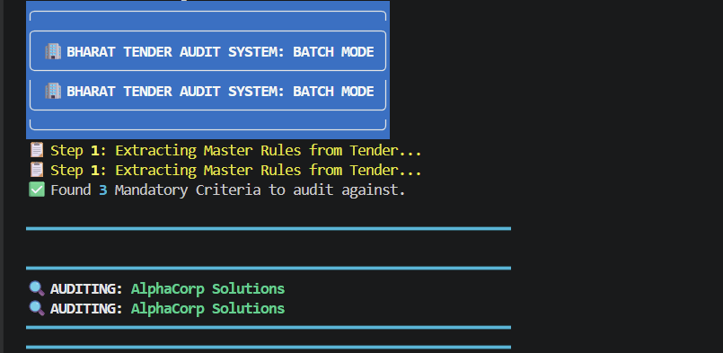
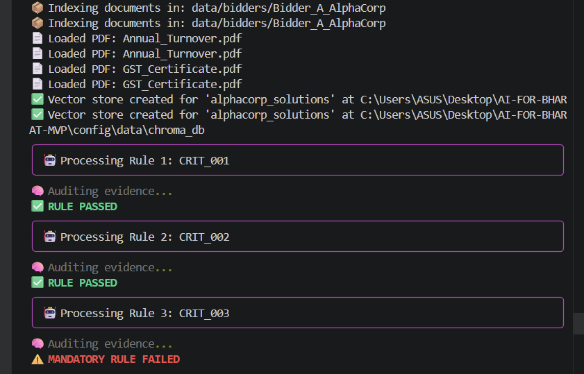
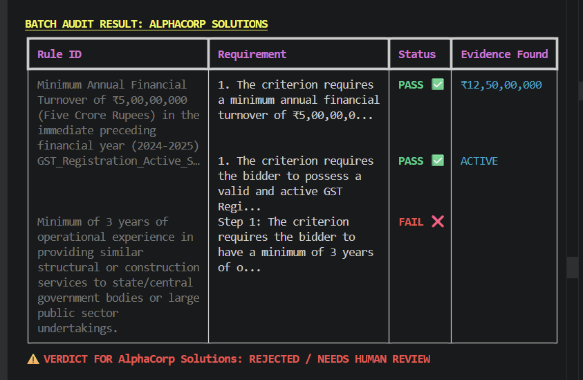
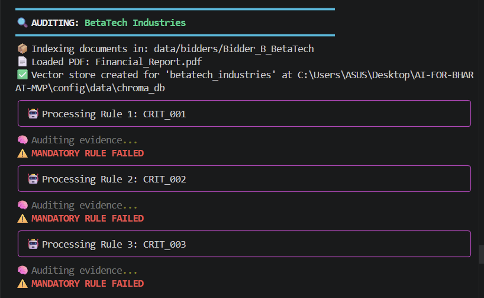
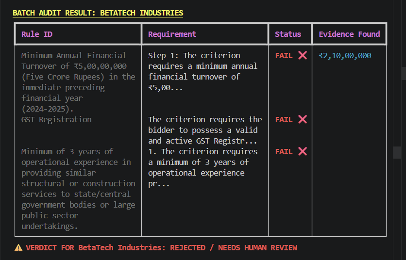
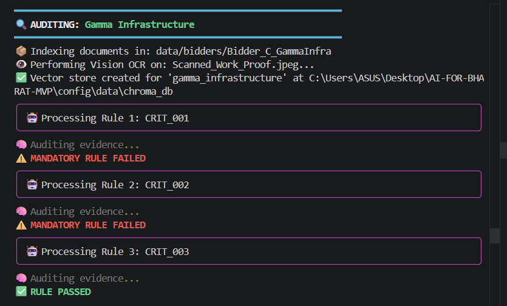
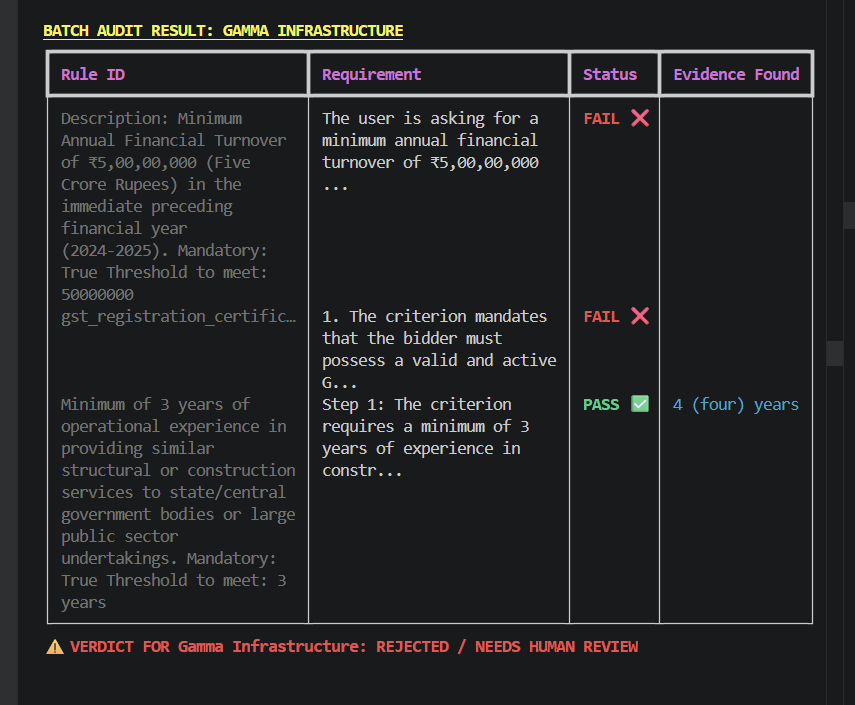

<div align="center">

# 🇮🇳 Bharat Tender Audit Systems

### Autonomous AI-Powered Government Procurement Auditor

[](https://python.org)
[](https://langchain-ai.github.io/langgraph/)
[](https://deepmind.google/technologies/gemini/)
[](https://www.trychroma.com/)
[](LICENSE)

*Developed for the Bharat AI Hackathon — Replacing manual document verification with autonomous AI reasoning.*

</div>

---

## The Problem

India processes **thousands of government tenders every year**. Each tender requires evaluating multiple bidders across dozens of eligibility criteria — turnover thresholds, GST registrations, years of experience, and more. This process is:

- ⏱️ **Slow** — manual cross-referencing of stacks of PDFs takes weeks
- ❌ **Error-prone** — human fatigue leads to missed documents and incorrect rejections
- 🔒 **Opaque** — no audit trail for why a bidder was accepted or rejected
- 📄 **Multiformat chaos** — bidders submit a mix of digital PDFs and scanned photos

**The Bharat Tender Audit System solves all of this autonomously.**

---

## What It Does

The system reads a **Notice Inviting Tender (NIT)** PDF — the official rulebook — and automatically extracts every eligibility criterion. It then audits each bidder's submitted documents against those criteria, producing a structured, explainable report for each company.

```
Tender PDF (NIT) ──► Extract Criteria ──► Audit Bidder A ──► PASS / FAIL + Evidence
                                       ──► Audit Bidder B ──► PASS / FAIL + Evidence
                                       ──► Audit Bidder C ──► PASS / FAIL + Evidence
```

No manual reading. No missed documents. Full audit trail.

---

## Tech Stack

| Component | Technology | Role |
|-----------|-----------|------|
| **Orchestration** | LangGraph | State machine that drives the audit workflow |
| **Reasoning LLM** | Gemini 2.5 Pro | Evaluates evidence against criteria thresholds |
| **OCR / Speed LLM** | Gemini 2.5 Flash | Reads scanned photos and handwritten documents |
| **Vector Database** | ChromaDB (Persistent) | Stores and retrieves bidder document chunks |
| **RAG Framework** | LangChain | Document loading, chunking, and embedding |
| **Terminal UI** | Rich | Professional formatted console output |
| **Data Contracts** | Pydantic | Validates all structured JSON outputs |

---

## Project Structure

```
AI-FOR-BHARAT-MVP/
│
├── config/
│   ├── settings.py         # Global API config & model versions
│   └── prompts.yaml        # Centralized AI prompts & instructions
│
├── data/
│   ├── tenders/            # Notice Inviting Tender (NIT) PDFs go here
│   ├── bidders/            # One sub-folder per bidder (PDFs + scanned images)
│   └── chroma_db/          # Auto-generated persistent vector memory
│
├── src/
│   ├── engine/
│   │   ├── parser.py       # PDF text extraction + Gemini Vision OCR
│   │   └── vector_store.py # Document chunking, embedding & retrieval
│   │
│   ├── graph/
│   │   ├── state.py        # LangGraph shared memory schema
│   │   ├── nodes.py        # "Judge" node — the core auditor logic
│   │   └── workflow.py     # Graph connections & routing logic
│   │
│   └── schema.py           # Pydantic data contracts for JSON output
│
├── main_all.py             # Entry point — runs batch audit for all bidders
├── .env                    # API keys (never commit this)
└── requirements.txt
```

---

## Key Features

### 🖼️ Multimodal RAG
The system automatically detects whether a submitted file is a digital PDF or a scanned photograph. Scanned images are passed through **Gemini Vision**, which "reads" them like a human would — making them fully searchable alongside typed documents.

### 📋 Autonomous Checklist Generation
The system reads the Tender Rulebook **once** and produces a structured JSON checklist of every eligibility criterion — turnover thresholds, GST requirements, prior experience mandates, and more — without any human tagging.

### 🔒 Collection Isolation
Each bidder gets their own isolated ChromaDB collection. This guarantees **zero data leakage** between competing companies, even when running batch audits.

### ⚖️ Agentic Threshold Reasoning
Unlike a basic keyword search, the LangGraph **Judge Node** reasons about evidence. It doesn't just find "₹12 Cr" — it evaluates *"₹12 Cr > ₹5 Cr minimum required → PASS"* and explains why.

---

## Getting Started

### Prerequisites

- Python 3.10+
- A Google AI Studio API Key ([get one here](https://aistudio.google.com/))

### Installation

```bash
# 1. Clone the repository
git clone https://github.com/vishwajit0509/MVP-Ai-for-bharat.git
cd ai-for-bharat-mvp

# 2. Install dependencies
pip install -r requirements.txt

# 3. Set up your environment
cp .env.example .env
# Then open .env and add your API keys (see below)
```

### Environment Variables

Create a `.env` file in the root directory:

```env
# Required
GOOGLE_API_KEY="your_google_ai_studio_key_here"

# Optional — for LangSmith tracing & debugging
LANGCHAIN_TRACING_V2="true"
LANGCHAIN_API_KEY="your_langsmith_key_here"
LANGCHAIN_PROJECT="bharat-tender-audit"
```

### Add Your Data

```
data/
├── tenders/
│   └── your_tender.pdf                      # The NIT / rulebook PDF
├── output/                                  # Auto-generated audit reports
└── bidders/
    ├── Bidder_A_AlphaCorp/
    │   ├── Annual_Turnover.pdf
    │   └── GST_Certificate.pdf
    ├── Bidder_B_BetaTech/
    │   └── Financial_Report.pdf
    └── Bidder_C_GammaInfra/
        └── Scanned_Work_Proof.jpeg          # Scanned images are supported too
```

Each bidder gets their own folder. Mix and match PDFs and scanned images freely — the system handles both automatically.

### Run the Audit

```bash
python main_all.py
```

The system will process every bidder folder and output a structured verdict for each.

---

## results 









## Roadmap

The MVP core is complete. The following nodes are planned for v2:

| Node | Purpose | Status |
|------|---------|--------|
| **Query Refinement** | If "GST" finds nothing, retry with "Tax ID", "GSTIN", etc. to prevent unfair rejections | 🔲 Planned |
| **Fraud Detection** | Cross-reference data across documents (e.g., company name must match across GST cert and bank statement) | 🔲 Planned |
| **Human-in-the-Loop** | Pause the graph and request human review when evidence is "Ambiguous" | 🔲 Planned |
| **Competency Scoring** | Go beyond Pass/Fail — assign a score based on *how far* a bidder exceeds minimum thresholds | 🔲 Planned |

---

## Why This Matters

Government procurement in India is a multi-trillion rupee ecosystem. Even a small reduction in processing time and human error translates to:

- Faster project execution
- More transparent, auditable decisions
- Reduced scope for corruption through consistent, documented verdicts
- A level playing field for smaller bidders whose paperwork is often overlooked

---

<div align="center">

Built with ❤️ for the **Bharat AI Hackathon**

*Making India's procurement infrastructure AI-ready, one tender at a time.*

</div>
